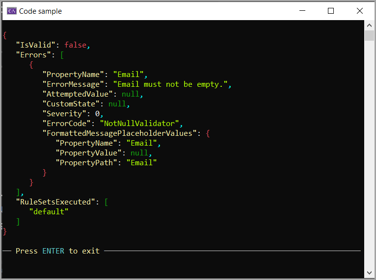

# About

Example taken from FluentValidation documentation to demonstrate how to use [inheritance validation](https://docs.fluentvalidation.net/en/latest/inheritance.html).

Since the example code is incomplete I decided to complete it as this is useful to have.



## Validators

```csharp
public class OrganisationValidator : AbstractValidator<Organisation>
{
    public OrganisationValidator()
    {
        RuleFor(x => x.Name).NotNull();
        RuleFor(x => x.Email).NotNull();
        RuleFor(x => x.Headquarters).SetValidator(new AddressValidator());
    }
}

public class AddressValidator : AbstractValidator<Address>
{
    public AddressValidator()
    {
        RuleFor(x => x.Street).NotNull();
        RuleFor(x => x.City).NotNull();
        RuleFor(x => x.PostCode).NotNull();
    }
}
```

## Usage

Setup to fail validation and write errors as json.

```csharp
internal partial class Program
{
    static void Main(string[] args)
    {

        Organisation organisation = new()
        {
            Name = "Acme",
            //Email = "Acme@gmail.com",
            Headquarters = new()
            {
                Street = "123 Main St",
                City = "Any town",
                PostCode = "12345"
            }
        };

        OrganisationValidator validator = new();
        ValidationResult result = validator.Validate(organisation);
        if (result.IsValid)
        {
            AnsiConsole.MarkupLine("[yellow]Valid[/]");
        }
        else
        {
            PresentJson(JsonSerializer.Serialize(result));
        }

        ExitPrompt();
    }
}
```