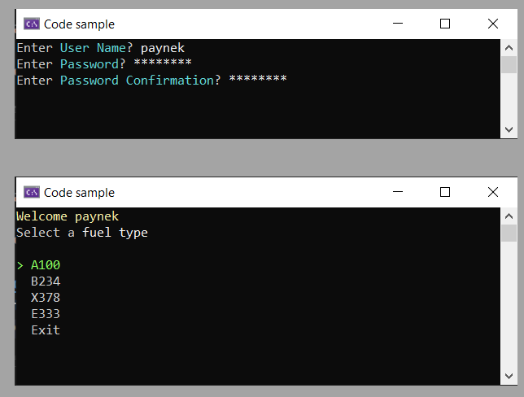

# About

An example to validate user name and password with password confirmation using Fluent validation library.

## Frameworks

- This project NET8
- Validation library NET7



## Validation class project

Contains the Person model and validators used in this project. Note that the validator class for Person uses other validators for reusability.

```csharp
public class PersonValidator : AbstractValidator<Person>
{
    public PersonValidator()
    {
        Include(new UserNameValidator());
        Include(new PasswordValidator());
        Include(new EmailAddressValidator());
        Include(new PhoneNumberValidator());
    }
}
```

The Password validator was kept simple as each reader can apply their own rules.

```csharp
public class PasswordValidator : AbstractValidator<Person>
{

    public PasswordValidator()
    {

        RuleFor(person => person.Password.Length)
            .GreaterThan(7);

        RuleFor(person => person.Password)
            .Equal(p => p.PasswordConfirmation)
            .WithState(x => StatusCodes.PasswordsMisMatch);

    }
}
```

For instance, the following may or may not suite each organizations requirements.

```csharp
public class PassWordValidator : AbstractValidator<Person>
{
    public PassWordValidator()
    {
        RuleFor(p => p.Password).NotEmpty().WithMessage("Your password cannot be empty")
            .MinimumLength(8).WithMessage("Your password length must be at least 8.")
            .MaximumLength(16).WithMessage("Your password length must not exceed 16.")
            .Matches(@"[A-Z]+").WithMessage("Your password must contain at least one uppercase letter.")
            .Matches(@"[a-z]+").WithMessage("Your password must contain at least one lowercase letter.")
            .Matches(@"[0-9]+").WithMessage("Your password must contain at least one number.")
            .Matches(@"[\!\?\*\.]+").WithMessage("Your password must contain at least one (!? *.).");
    }
}
```