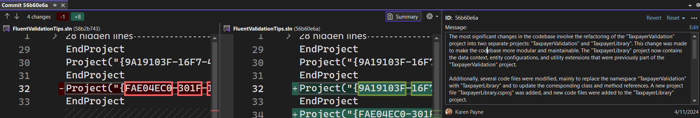
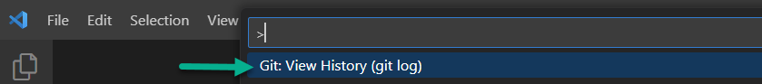
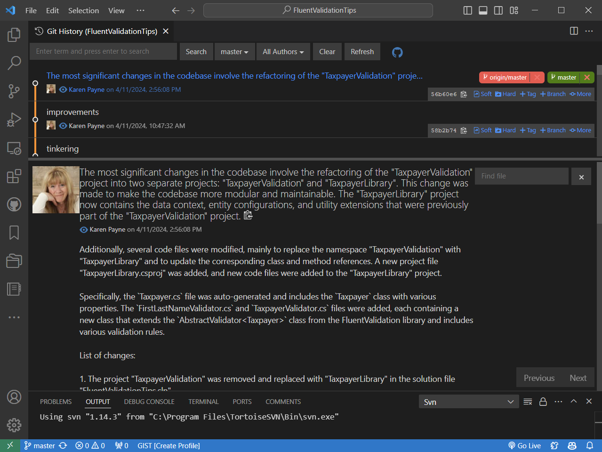

# VS2022/Git History

> **Note**
> This comes from AI generated commit message possibly have a good deal more text than prior to AI generated commit messages.

In VS2022, viewing a commits history we see the following which as shown, the comment text window has been expanded hortzontally to view the text but can not expand vertically.

In VS Code, we see a full split window with the commit text. 

## Suggestion for VS2022

Allow the comment text to be able to place in a bottom section or perhaps allow the comment text window to float.