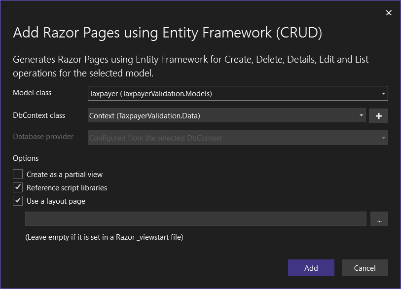

# About

This project is to demonstrate the basics for working with SQL-Server database data using Microsoft [EF Core](https://learn.microsoft.com/en-us/ef/core/) which is the flagship for working with data from any major database.

## Code notes

- Code time two hours
- Much of the code could be placed in a class project
- All containers and configurations for interacting with data were done using a free extension to Visual Studio known as [EF Power Tools](https://marketplace.visualstudio.com/items?itemName=ErikEJ.EFCorePowerTools).
- Logging for data operations by Karen Payne's [EntityCoreFileLogger](https://www.nuget.org/packages/EntityCoreFileLogger/#readme-body-tab) NuGet package.
- Using Visual Studio, CRUD pages where created as shown below



## Karen's work

- Setup data annotations
- Add [FluentValidation.AspNetCore](https://www.nuget.org/packages/FluentValidation.AspNetCore/11.3.0?_src=template) NuGet package to provide the base for model validation
- [Bogus](https://www.nuget.org/packages/Bogus/35.5.0?_src=template) NuGet package to create random Taxpayer
- [CountryValidator](https://www.nuget.org/packages/CountryValidator/1.1.3?_src=template) Nuget package to validate SSN by country
- Added custom validation rules
    - FirstLastNameValidator validates first and last name
    - BirthDateRule is an example for date validation in general

```csharp
public class TaxpayerValidator : AbstractValidator<Taxpayer>
{
    public TaxpayerValidator()
    {
        

        Include(new FirstLastNameValidator());
        
        Transform(
                from: customer => customer.SSN, 
                to: value => value.IsSocialSecurityNumberValid())
            .Must(value => value)
            .WithMessage("SSN is required and must be valid");


        RuleFor(x => x.PIN).MinimumLength(4).WithMessage("Must be four numbers");
        RuleFor(x => x.StartDate).BirthDateRule();
    }
}
```

- Added the following to split property names in error messages. Note any method marked with `[ModuleInitializer]` runs at start of application. DO NOT use [[ModuleInitializer]](https://learn.microsoft.com/en-us/dotnet/csharp/language-reference/proposals/csharp-9.0/module-initializers) unless you understand the purpose of this attribute.

```csharp
internal class FluidSetup
{
    [ModuleInitializer]
    public static void InitializeFluentValidation()
    {

        ValidatorOptions.Global.DisplayNameResolver = (type, memberInfo, expression) =>
            ValidatorOptions.Global.PropertyNameResolver(type, memberInfo, expression)
                .SplitPascalCase();
    }
}
```

## EF Core

Connection string is in `appsettings.json` in the project's base folder.

```json
{
  "Logging": {
    "LogLevel": {
      "Default": "Information",
      "Microsoft.AspNetCore": "Warning"
    }
  },
  "AllowedHosts": "*",
  "ConnectionStrings": {
    "DefaultConnection": "Data Source=(localdb)\\MSSQLLocalDB;Initial Catalog=FluentValidation1;Integrated Security=True"
  }

}
```

- In Data\Context.cs, a [DbSet](https://learn.microsoft.com/en-us/dotnet/api/microsoft.entityframeworkcore.dbset-1?view=efcore-8.0) represents a table in a database.
- Tables/DbSet are configure in a special class e.g.

```csharp
public partial class TaxpayerConfiguration : IEntityTypeConfiguration<Taxpayer>
{
    public void Configure(EntityTypeBuilder<Taxpayer> entity)
    {
        entity.Property(e => e.PIN)
            .HasMaxLength(4)
            .IsFixedLength();

        OnConfigurePartial(entity);
    }

    partial void OnConfigurePartial(EntityTypeBuilder<Taxpayer> entity);
}
```

To see more robust configurations see project `NorthWindLibrary` Data\Configurations.

## Depedency Injection (DI)

- FluentValidation.AspNetCore
- EF Core

Are both setup in Program.cs in the base folder of the project and created in C# code for each ASP.NET Core page that use them in the constructor of the page.

Example for the create page

- EF Core: Data.Context _context
- FluentValidation: IValidator&lt;Taxpayer> _validator

```csharp
namespace TaxpayerValidation.Pages
{
    public class CreateModel : PageModel
    {
        private readonly Data.Context _context;
        private IValidator<Taxpayer> _validator;

        public CreateModel(Data.Context context, IValidator<Taxpayer> validator)
        {
            _context = context;
            _validator = validator;
        }
    . . .
```