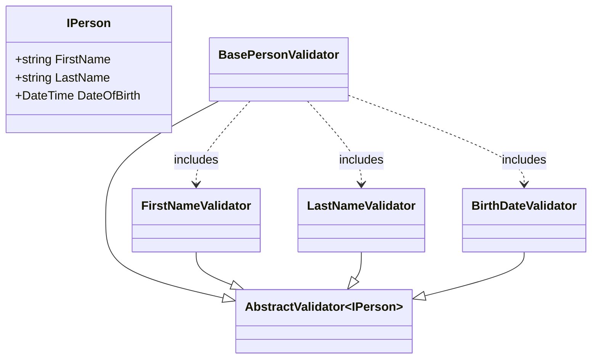

# About

Demonstrates using FluentValidation [Include](https://docs.fluentvalidation.net/en/latest/including-rules.html) validators as shown below.

See project `ValidationLibrary1` for validators.

```csharp
public class BasePersonValidator : AbstractValidator<IPerson>
{
    public BasePersonValidator()
    {
        Include(new FirstNameValidator());
        Include(new LastNameValidator());
        Include(new BirthDateValidator());
    }
}
```

## BasePersonValidator visualization

