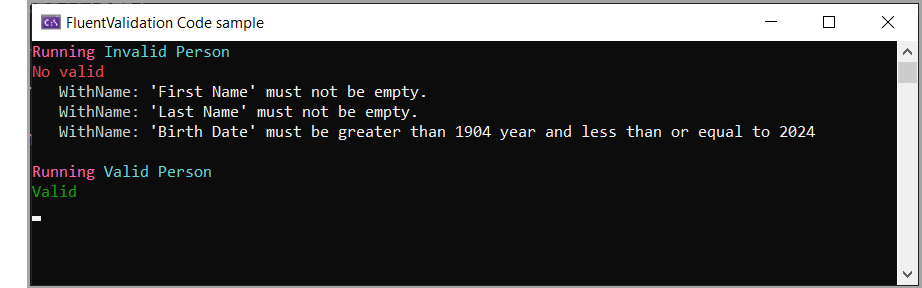

# FluentValidation sample

An example for

- Custom rule `BirthDateRule` using an extension method which implements `IRuleBuilderOptions`
- A shared validator for two properties FirstName and LastName
- A Global.DisplayNameResolver to split property names in error messages. Must examples on the web show `SplitPascalCase()` but fail to mention its an internal method now.

