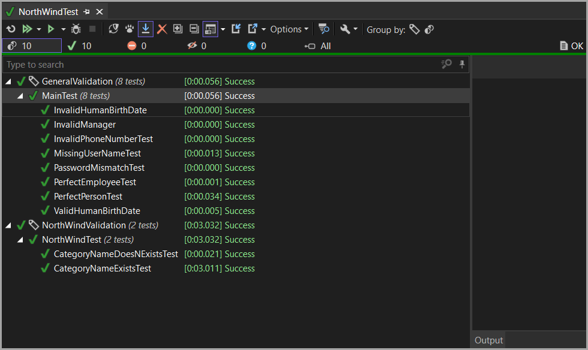
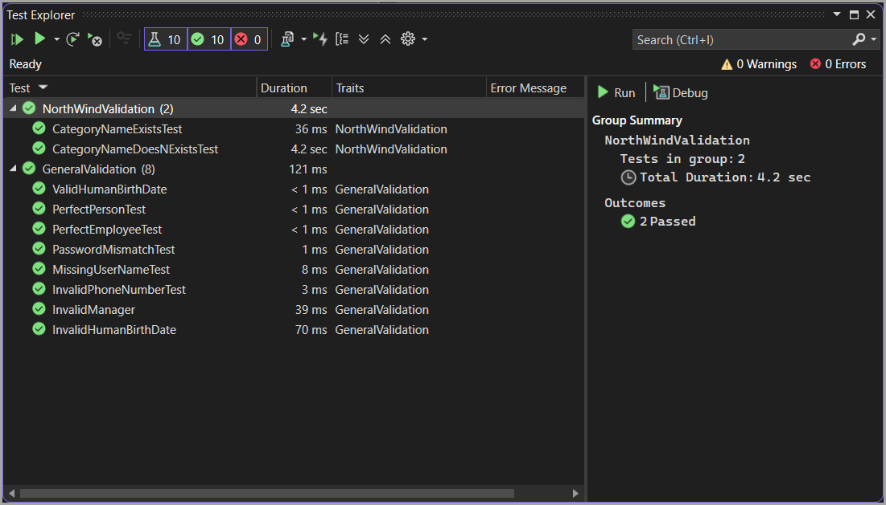

# About

Shows how to group test by traits/categories.

## Setup

1. Add `Base.TestBase.cs`
1. Add `Base.TestTraitsAttribute.cs`
1. In `Base.Main.cs`, add the following line: `TestResults = new List<TestContext>()`

```csharp
[ClassInitialize()]
public static void ClassInitialize(TestContext testContext)
{
    TestResults = new List<TestContext>();
}
```
## Traits/Categories

The following traits/categories are used in this project in `TestTraitsAttribute.cs`

- GeneralValidation
- NorthWindValidation

`PlaceHolder` is for stubbing using JetBrains template.


## JetBrains test runner




## Test Explorer

